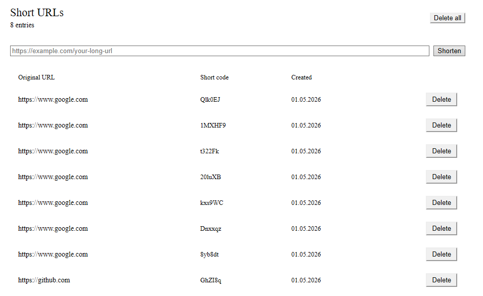

## URL Shortener

Project to generate short links from any URLs and send them to anyone who needs it.

# Used technologies
- Backend: ASP.Net Core, EF Core, Automapper 
- Frontend: React, React Router, Axios
- Security: ASP.Net Identity, JWT
- Tests: XUnit, Moq
- Database: MS SQL Server Express

# Deployment
To work with your database, create UrlShortenerDb schema, and then use this command for migration:
`dotnet ef database update [Name] --project Infrastructure --startup-project Web`

If you need to create the new migration, use 
`dotnet ef database migrations add [Name] --project Infrastructure --startup-project Web`

# Note
When you access the backend, you will be automatically redirected to the React SPA proxy.

To shorten the link or access the detailed info of it, you need to login or register.

By Vasyl Ivasiuk [(@vjwua)](https://github.com/vjwua/)
